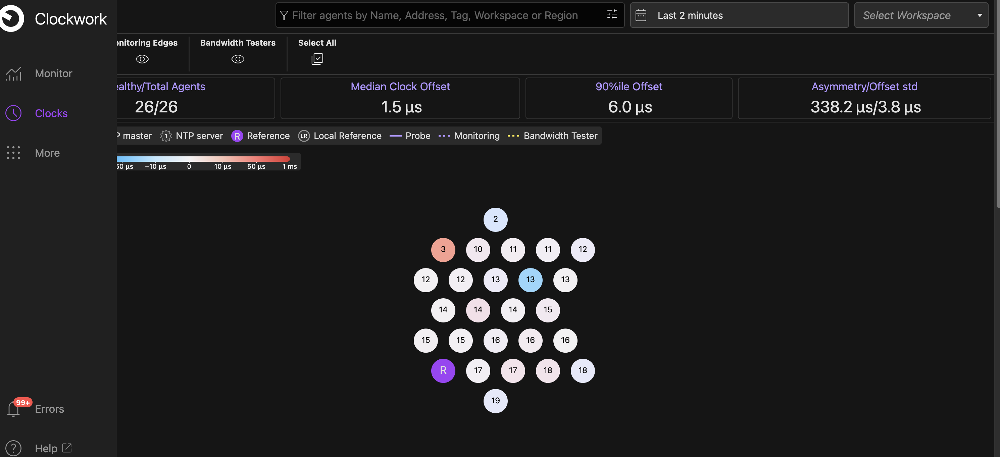
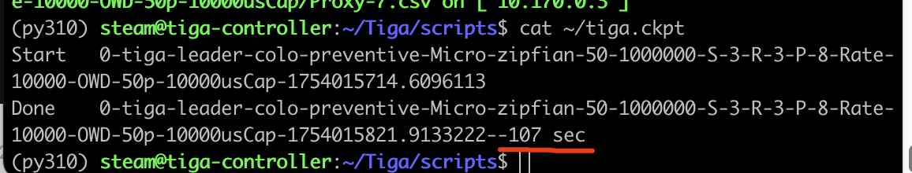
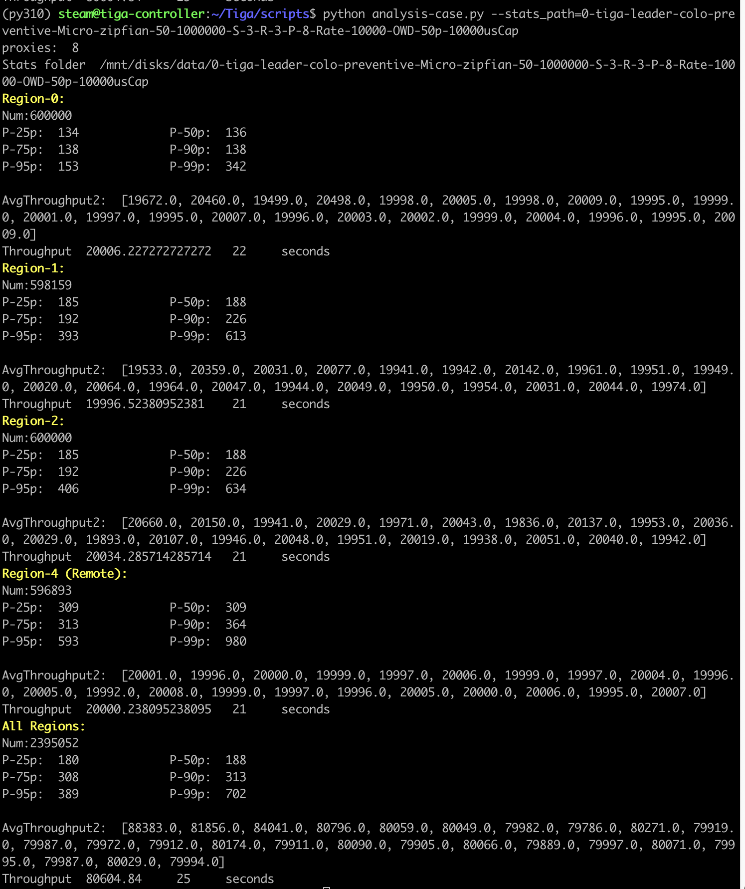

# Tiga: Lightweight and Latency-Optimal Geo-Distributed Transactions with Loosely Synchronized Clocks [Artifact Evaluation]


## Getting started

All our evaluation is conducted on Google Cloud Platform (GCP), using n2-16-standard VMs. During the evaluation, we have applied the high-accuracy clock synchronization algorithm, i.e., [Huygens](), to synchronize the clocks for all VMs. Huygens is now available on GCP, and GCP tenants can install the algorithm easily following the instruction [here](https://www.usenix.org/system/files/conference/nsdi18/nsdi18-geng.pdf). 

The free trial of Huygens only allow 10 VMs to be synchornized and tenants need to pay for the larger-scale cluster. To make it easy for evaluators to conduct artifact evaluation, we have provisioned and installed the Huygens service for our GCP cluster and the cluster is open to evaluators during the evaluation period. Besides, evaluators can also choose to use Chrony/NTP to synchronize cluster clocks. Chrony and NTP are already available on GCP and they can also provide sufficiently good synchronization for Tiga to achieve high performance.


**We recommend the evaluators directly use our cluster**, because we have configured the environment on the cluster and compiled the corresponding binaries. We will undertake the cost of the cloud computing resource (Special thanks to Google Research Credit Program). Of course, **building everything from scratch is also do-able**, and we provide the instruction document [here](deploy.md).


## Evaluation Workflow


- Log into the controller VM. Initially, we have shut down all VMs in our cluster and only have one controller VM turned on. We have provided a dropbox link to share the private SSH key file in the submitted material (`Technical Requiremens`), and evaluators use the key to log into the controller and proceed the follow-up workflow. **If you have not received the SSH key file (`ae_rsa`), please contact gjk1994@stanford.edu.** 

```
ssh -i ae_rsa steam@ControllerIP
```
The Controller IP has also be included in the shared dropbox link, see file `login-ssh-cmd`. 

34.73.25.115 is the controller's IP address. We have launched the dashboard to monitor clock synchronization of the cluster, which can be viewed from any browser at http://xxxx/sensei/monitor/ (xxx is the ControllerIP). Initially, you can only view one circle (controller) on the dashboard, because the cluster has been shut down. Later you will see the synchronized servers on the dashboard as below. 

. 


If the dashboard nååeeds password, please check the file on the controller.

```
cat ~/dashboard-login
```


## Start Cluster 
All the control scripts are in the folder
```
cd ~/Tiga/scripts
```

We have prepared the Python environment to run all scripts
```
conda activate py310  
```

To first conduct evaluation with MicroBench, we need 3 shards and each shard is replicated across 3 regions. We also need 8 proxies and they are distributed across 4 regions. 
```
python start_machines.py --num_replicas=3 --num_shards=3 --num_proxies=8
```
Later when we conduct evaluation with TPCC, we need 6 shards, then --num_shards=6.

After servers and proxies are all started, we then launch Huygens to synchronize their clocks. 

```
python clock_sync.py --num_replicas=3 --num_shards=3 --num_proxies=8 --action="start" --clock_sync="cwcs"
```

We can view the synchronization status on the dashboard. 


## Sample Run
Each test has been orchestrated as a test_plan yaml file under `scripts` folder. 

To make a quick functional test, we run 
```
 python run_test.py --num_replica=3 --num_shards=3 --num_proxies=8  --test_plan=sample_test_plan.yaml
```

The test_plan yaml allows us to configure the test cases we want to run and customize the parameters we want to use for each test case. We have configured the parameters for our test plans. No need for further modification. 

Besides, the other system-related parameters are configured in `scripts/tiga_common.py` For example `CHECK_POINT_FILE` defines the checkpoint file during long run, so that we can know which test cases have been completed. 
`STATS_PATH` defines where the collected data are stored (it is mounted as a 200GB disk). 


The `scripts/sample_test_plan.yaml` only contains one test case, and after it completes, we can open the checkpoint file at `tiga_common.CHECK_POINT_FILE`: one test case usually takes around 110 seconds, counting from starting the case to finishing collecting the data. Here the checkpoint looks like the below. 



Let's analysis the performance number of the case.
```
python analysis-case.py --stats_path=0-tiga-leader-colo-preventive-Micro-zipfian-50-1000000-S-3-R-3-P-8-Rate-10000-OWD-50p-10000usCap
```
The valid analytical results should be like this.


Since the test case uses 8 open-loop proxies and each proxy submits txns at 10K/sec. The total throughput is 80K txns/sec. Meanwhile, Tiga achieves 1-WRTT for most txns, so we can see the latency from each region also meets our expectation. 

## Artifact Evaluation Workflow

Before we proceed with the artifact evaluation, we highlight a few points. 

- In our paper,  we have run each test case 5 times and report the median value, which helps to remove the noise and variance. However, that could be very time-consuming since each test case takes about 110 seconds. Therefore, in this artifact evaluation, we simplify the test by picking less data points and only run each case once. Therefore, there can be some noise in the data points. **Even in this way, the artifact evaluation will still take a few hours.** Therefore, we recommend using `tmux` to avoid accidental interruption on your terminal, and keep checking the checkpoint file configured at `tiga_common.CHECK_POINT_FILE` to understand the progress. 

- While cloud providers (e.g., GCP, Azure, AWS) try to provide same QoS for all tenants, we previously observed that VMs may not necessarily show the same performance every time, see [Chapter 3](https://stacks.stanford.edu/file/druid:xq718qd4043/Vig_thesis_submission-augmented.pdf). Fourtunately, according to our repeated tests, the reported numbers, while exhibiting some variance, always consistency imply the same conclusion included in our paper. Besides, our experience shows that, when launching VMs in the evening, the VM's performance tends to be better than morning VM. 


- We have further optimized our codebase since the submission. Therefore, some performance number can be even higher. 


Next we will do the real artifact evaluation and plot the figures in our paper. One important flag in `scripts/tiga_common.py` is `tiga_common.SHUTDOWN_AFTER_RUN=True`. Below, after running every group of test cases, the script will shut down the cluster (in case the evaluators forget to do so) and stop burning the money.


### Figure 6 and Figure 7
First, turn on the cluster with 3x3+8=17 servers.
```
tmux

cd ~/Tiga/scripts

conda activate py310

python start_machines.py --num_replicas=3 --num_shards=3 --num_proxies=8
```

Wait for about 10 seconds so that GCP VMs have all been launched.

Then, launch clock synchronization to synchronze all servers. 
```
python clock_sync.py --num_replicas=3 --num_shards=3 --num_proxies=8 --action="start" --clock_sync="cwcs"
```

Wait for about 10 seconds, so that Huygens (CWCS) clock synchronization algorithms can synchronize all clocks to a small error.  After that, we can run the test cases automatically.

We have configured the test plan as `scripts/test_plan_micro_vary_rate.yaml`, which contains more than 50 test cases, so please run them in `tmux` session.

```
python run_test.py --num_replica=3 --num_shards=3 --num_proxies=8  --test_plan=test_plan_micro_vary_rate.yaml
```

`Crtl B+D` to exit tmux session, so that it will run in the background without any interrupts. 

After completing these test cases, the data have all been collected in `tiga_common.STATS_PATH`. Then we can process these data to generate some CSV files, which will be used to plot figures.

```
python analysis.py  --num_replicas=3 --num_shards=3 --num_proxies=8 --test_plan=test_plan_micro_vary_rate.yaml
```

After the data is processed, we have some csv files generated under `tiga_common.SUMMARY_STATS_PATH`. These CSV file names share the same prefix as the yaml file (i.e., test_plan_micro_vary_rate*.csv).

Next, we plot the figure(s) as 

```
python plot_vary_rate.py  --test_plan=test_plan_micro_vary_rate.yaml --tag=Micro-Vary-Rate 
```
Then the figure(s) will be generated under `tiga_common.FIGS_PATH`, and Figure 6 corresponds to `Micro-Vary-Rate-Local-1-legend.pdf` and Figure 7 corresponds to `Micro-Vary-Rate-Remote-legend.pdf`.


### Figure 8

First, turn on the cluster with 3x3+8=17 servers.
```
tmux

cd ~/Tiga/scripts

conda activate py310

python start_machines.py --num_replicas=3 --num_shards=3 --num_proxies=8
```

Wait for about 10 seconds so that GCP VMs have all been launched.


Then, launch clock synchronization to synchronze all servers. 
```
python clock_sync.py --num_replicas=3 --num_shards=3 --num_proxies=8 --action="start" --clock_sync="cwcs"
```

Wait for about 10 seconds, so that Huygens (CWCS) clock synchronization algorithms can synchronize all clocks to a small error.  After that, we can run the test cases automatically.


We have configured the test plan as `scripts/test_plan_micro_vary_skew.yaml`
```
python run_test.py --num_replica=3 --num_shards=3 --num_proxies=8  --test_plan=test_plan_micro_vary_skew.yaml
```

After completing these test cases, the data have all been collected in `tiga_common.STATS_PATH`. Then we can process these data to generate some CSV files, which will be used to plot figures.
```
python analysis.py  --num_replicas=3 --num_shards=3 --num_proxies=8  --test_plan=test_plan_micro_vary_skew.yaml

```
After the data is processed, we have some csv files generated under `tiga_common.SUMMARY_STATS_PATH`. These CSV file names share the same prefix as the yaml file (i.e., test_plan_micro_vary_skew*.csv).

Next, we plot the figure(s) as 

```
python plot_vary_skew.py  --test_plan=test_plan_micro_vary_skew.yaml --tag=Micro-Vary-Skew 
```
Then the figure(s) will be generated under `tiga_common.FIGS_PATH`, and Figure 8 corresponds to `Micro-Vary-Skew-All-legend.pdf`


### Figure 9

First, turn on the cluster with **3x6+8=26** servers.
```
tmux

cd ~/Tiga/scripts

conda activate py310

python start_machines.py --num_replicas=3 --num_shards=6 --num_proxies=8
```

Wait for about 10 seconds so that GCP VMs have all been launched.


Then, launch clock synchronization to synchronze all servers. 
```
python clock_sync.py --num_replicas=3 --num_shards=6 --num_proxies=8 --action="start" --clock_sync="cwcs"
```

Wait for about 10 seconds, so that Huygens (CWCS) clock synchronization algorithms can synchronize all clocks to a small error.  After that, we can run the test cases automatically.


We have configured the test plan as `scripts/test_plan_tpcc_vary_rate.yaml`
```
python run_test.py --num_replica=3 --num_shards=6 --num_proxies=8  --test_plan=test_plan_tpcc_vary_rate.yaml
```

After completing these test cases, the data have all been collected in `tiga_common.STATS_PATH`. Then we can process these data to generate some CSV files, which will be used to plot figures.
```
python analysis.py  --num_replicas=3 --num_shards=6 --num_proxies=8  --test_plan=test_plan_tpcc_vary_rate.yaml
```
After the data is processed, we have some csv files generated under `tiga_common.SUMMARY_STATS_PATH`. These CSV file names share the same prefix as the yaml file (i.e., test_plan_tpcc_vary_rate*.csv).

Next, we plot the figure(s) as 

```
python plot_vary_rate_tpcc.py  --test_plan=test_plan_tpcc_vary_rate.yaml --tag=TPCC-Vary-Rate 
```
Then the figure(s) will be generated under `tiga_common.FIGS_PATH`, and Figure 9 corresponds to `TPCC-Vary-Rate-All-legend.pdf`


### Figure 10

First, turn on the cluster with 3x3+8=17 servers.
```
tmux

cd ~/Tiga/scripts

conda activate py310

python start_machines.py --num_replicas=3 --num_shards=3 --num_proxies=8
```

Wait for about 10 seconds so that GCP VMs have all been launched.


Then, launch clock synchronization to synchronze all servers. 
```
python clock_sync.py --num_replicas=3 --num_shards=3 --num_proxies=8 --action="start" --clock_sync="cwcs"
```

Wait for about 10 seconds, so that Huygens (CWCS) clock synchronization algorithms can synchronize all clocks to a small error.  After that, we can run the test cases automatically.


We have configured the test plan as `scripts/test_plan_failure_recovery.yaml`
```
python run_test.py --num_replica=3 --num_shards=3 --num_proxies=8  --test_plan=test_plan_failure_recovery.yaml
```

After completing these test cases, the data have all been collected in `tiga_common.STATS_PATH`. We directly plot the figure based on the collected data. 
```
python plot_failure_recovery.py  --test_plan=test_plan_failure_recovery.yaml
```
Then the figure(s) will be generated under `tiga_common.FIGS_PATH`, and Figure 10 corresponds to `failure-recovery-thpt.pdf` and `failure-recovery-latency-region.pdf`


### Figure 11


First, turn on the cluster with 3x3+8=17 servers.
```
tmux

cd ~/Tiga/scripts

conda activate py310

python start_machines.py --num_replicas=3 --num_shards=3 --num_proxies=8
```

Wait for about 10 seconds so that GCP VMs have all been launched.


Then, launch clock synchronization to synchronze all servers. 
```
python clock_sync.py --num_replicas=3 --num_shards=3 --num_proxies=8 --action="start" --clock_sync="cwcs"
```

Wait for about 10 seconds, so that Huygens (CWCS) clock synchronization algorithms can synchronize all clocks to a small error.  After that, we can run the test cases automatically.


We have configured the test plan as `scripts/test_plan_preventive_detective.yaml`
```
python run_test.py --num_replica=3 --num_shards=3 --num_proxies=8  --test_plan=test_plan_preventive_detective.yaml
```


After completing these test cases, the data have all been collected in `tiga_common.STATS_PATH`. Then we can process these data to generate some CSV files, which will be used to plot figures.
```
python analysis.py  --num_replicas=3 --num_shards=3 --num_proxies=8  --test_plan=test_plan_preventive_detective.yaml
```
After the data is processed, we have some csv files generated under `tiga_common.SUMMARY_STATS_PATH`. These CSV file names share the same prefix as the yaml file (i.e., test_plan_preventive_detective*.csv).

Next, we plot the figure(s) as 

```
python plot_preventive_detective.py  --test_plan=test_plan_preventive_detective.yaml --tag=Micro-Colo-Sepa
```
Then the figure(s) will be generated under `tiga_common.FIGS_PATH`, and Figure 11 corresponds to `Micro-Colo-Sepa-Local-1-legend.pdf` and `Micro-Colo-Sepa-Remote-legend.pdf`


### Figure 12

First, turn on the cluster with 3x3+8=17 servers.
```
tmux

cd ~/Tiga/scripts

conda activate py310

python start_machines.py --num_replicas=3 --num_shards=3 --num_proxies=8
```

Wait for about 10 seconds so that GCP VMs have all been launched.


We have configured the test plan as `scripts/test_plan_clock_sync.yaml`
```
python run_test.py --num_replica=3 --num_shards=3 --num_proxies=8  --test_plan=test_plan_clock_sync.yaml
```


After completing these test cases, the data have all been collected in `tiga_common.STATS_PATH`. Then we can process these data to generate some CSV files, which will be used to plot figures.
```
python analysis.py  --num_replicas=3 --num_shards=3 --num_proxies=8  --test_plan=test_plan_clock_sync.yaml
```
After the data is processed, we have some csv files generated under `tiga_common.SUMMARY_STATS_PATH`. These CSV file names share the same prefix as the yaml file (i.e., test_plan_clock_sync*.csv).

Next, we plot the figure(s) as 

```
python plot_preventive_detective.py  --test_plan=test_plan_clock_sync.yaml --tag=Clock
```
Then the figure(s) will be generated under `tiga_common.FIGS_PATH`, and Figure 12 corresponds to `Clock-Local-1-legend.pdf` and `Clock-Remote-legend.pdf`


## License
This project will be open-sourced soon (after we release our camera-ready version), and the tentative licence will be MIT license.

## Acknowledgement
We sincerely appreciate the support from [Google Research Credit Program](https://edu.google.com/intl/ALL_us/programs/credits/research).
